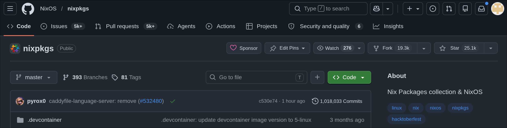
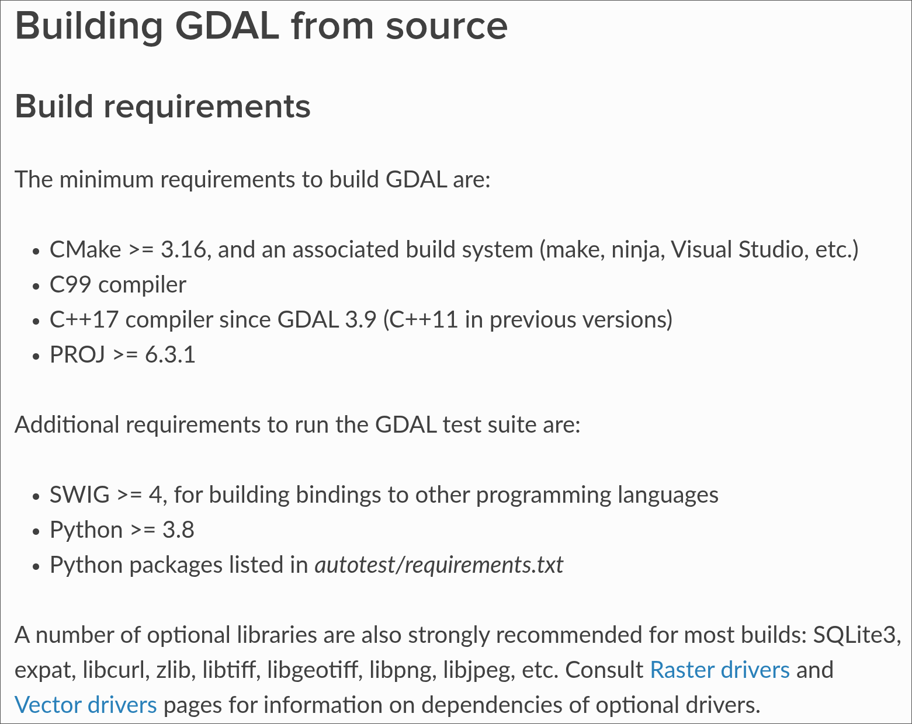

<!-- alignment: center -->
<!-- jump_to_middle -->

# Nix for reproducible research
## Beaudan Campbell-Brown

<!-- end_slide -->
<!-- alignment: center -->
# Plan

<!-- column_layout: [1, 1] -->

<!-- column: 0 -->


## Overview

- Why Nix
    - should make your life easier
- How does it work (briefly)
    - tip of the iceberg
- How you use it
    - language, tool, ecosystem
- How I am using it
    - everything

<!-- column: 1 -->
## Suggestions

- Ask questions
    - what do you want to know
- Slow me down
    - tell me your interests
- Anything is possible
    - yes it can do that¹
- Live is impressive
    - if I can show it I will

<!-- reset_layout -->
<!-- pause -->
# Why Nix

<!-- column_layout: [1, 1] -->

<!-- column: 0 -->

## Traditional

- Running software should be easy
    - laziness, impatience, and hubris
- Docker feels wrong
    - a VM for my database?
- Why am I following a README
    - it's just a script that doesn't work
- Too many tools
    - I don't care how it's done

<!-- column: 1 -->

## Nix

- Everything is code, code is debuggable
    - can be correct
- Changes can be fearless
    - git is your backups
- Someone already did it
    - it works on OUR machine
- Everything is composable
    - everything is a function

<!-- reset_layout -->
<!-- pause -->

<!-- end_slide -->
<!-- alignment: center -->

# What is Nix?

**Nix is a tool for configuring, building and deploying software reproducibly.**

<!-- column_layout: [1, 1] -->

<!-- column: 0 -->

## Traditional

- Imperative
    - <span style="color: #f38ba8">step 1, step 2</span>
- Stateful
    - <span style="color: #f38ba8">success depends on ambient environment</span>
- Fragmented
    - <span style="color: #f38ba8">what does "install" do?</span>
- Transient
    - <span style="color: #f38ba8">it works while it's there</span>

<!-- column: 1 -->

## Nix

- Declarative
    - <span style="color: #94e2d5">describe the state you want</span>
- Hermetic
    - <span style="color: #94e2d5">success is transferable</span>
- Centralised
    - <span style="color: #94e2d5">everything in the /nix/store</span>
- Ephemeral
    - <span style="color: #94e2d5">leaves no trace</span>

<!-- reset_layout -->
<!-- pause -->
# What is software

<!-- column_layout: [1, 1] -->

<!-- column: 0 -->

## Software

- Compiled binaries
    - <span style="color: #94e2d5">browser, git, ffmpeg</span>
- Scripts
    - <span style="color: #94e2d5">bash, python</span>
- Full stack applications
    - <span style="color: #94e2d5">multi-process, database, daemons</span>
- System libraries
    - <span style="color: #94e2d5">glibc, openssl, cuda</span>

<!-- column: 1 -->

## Also software

- Development environments
    - <span style="color: #94e2d5">postgres, R, dependencies</span>
- Analysis pipelines
    - <span style="color: #94e2d5">load -> clean -> process -> output</span>
- Containers
    - <span style="color: #94e2d5">docker, SIF</span>
- Linux systems
    - <span style="color: #94e2d5">ansible, puppet, NixOS</span>
<!-- pause -->
<!-- reset_layout -->
# How is software ran
<!-- column_layout: [1, 1] -->

<!-- column: 0 -->

## Traditional

- Name referenced
    - <span style="color: #f38ba8">vague, best effort, fallible</span>
- Mutable
    - <span style="color: #f38ba8">updating, uninstalling, moving</span>
- Convention
    - <span style="color: #f38ba8">/usr/lib, /opt, /bin</span>

<!-- column: 1 -->

## Nix

- Hash referenced
    - <span style="color: #94e2d5">deterministic, guaranteed, unique</span>
- Immutable
    - <span style="color: #94e2d5">read only, version locked, isolated</span>
- Explicit
    - <span style="color: #94e2d5">nix store only, fail at eval time</span>

<!-- end_slide -->
<!-- alignment: center -->

# Quick peek behind the scenes
<!-- column_layout: [1, 1] -->

<!-- column: 0 -->
## Start from a minimal trusted base
Think compiler bootstrapping, Nix assembly
- shell: `bash`
- basic Unix tools: `coreutils`, `findutils`, `grep`, `sed`, `awk`
- archive tools: `tar`, `gzip`, `xz`, `bzip2`
- build tools: `make`, `patch`
- compiler toolchain: `gcc`, `binutils`, `libc`
<!-- pause -->
<!-- column: 1 -->

## Identify by the inputs
- Dependencies
- Source code
- Build instructions
- Hashed
<!-- pause -->
<!-- reset_layout -->
<!-- column_layout: [1, 8, 1] -->
<!-- column: 1 -->
## Downstream consumes from store
```bash +exec
# My /nix/store
/// dirs=$(fd . /nix/store --max-depth 1 --type d --format '{/}')
/// printf 'Nix store directories: %s\n\n' "$(printf '%s\n' "$dirs" | wc -l)"
/// printf '%s\n' "$dirs" | shuf -n 5
```
<!-- reset_layout -->
<!-- end_slide -->
<!-- alignment: center -->

# In practice
## Nixpkgs

- \>140,000 packages
- \>1,000,000 commits
- \>15,000 contributors
- Cross platform
- Cross architecture
<!-- end_slide -->
<!-- alignment: center -->
# In practice
<!-- column_layout: [1, 1] -->

<!-- column: 0 -->
## Binary substitutors
- Trusted
- Configurable
- Can build too
```bash +exec +acquire_terminal
# /etc/nix/nix.conf
/// nvim '+15' '+normal! wwvE' /etc/nix/nix.conf
```
<!-- pause -->

<!-- column: 1 -->
## Package manager
- nix build
- nix run
- nix develop
```bash +exec
nix run nixpkgs#cowsay "Wow!"
cowsay "Oh no!" || true
```
<!-- end_slide -->
<!-- alignment: center -->
# In research
## Multiple environments
- Local
- HPC
- Collaborators
- Local in 6 months
<!-- pause -->
## Tooling
<!-- column_layout: [1, 1, 1] -->

<!-- column: 0 -->
### R
- install.packages()
- pak
- renv
- packrat
<!-- pause -->
<!-- column: 1 -->
### HPC
- Modules
- Apptainer
- Docker
<!-- pause -->
<!-- column: 2 -->
### Python
- pip
- venv
- virtualenv
- uv
- conda
- mamba
- micromamba
- pipenv
- poetry
- pdm
- pixi
- pip-tools
- pipx
- pyenv
- ...
<!-- reset_layout -->
<!-- pause -->
---
- README
<!-- end_slide -->
<!-- alignment: center -->
# In research
<!-- column_layout: [1, 1, 1] -->

<!-- column: 0 -->
```bash +exec +acquire_terminal
# R with packages
/// nvim '+/pkgs.rP' '+normal! VGkkk' nix/r-env.nix
```
<!-- pause -->
<!-- column: 1 -->

```bash +exec +acquire_terminal
# Python with packages
/// nvim '+/python3' '+normal! VGk' nix/python-env.nix
```
<!-- pause -->
<!-- column: 2 -->
```bash +exec +acquire_terminal
# General packages
/// nvim '+/bashInteractive' '+normal! VG' nix/demo-packages.nix
```
<!-- reset_layout -->
<!-- pause -->
## For referrence...

<!-- end_slide -->
<!-- alignment: center -->
# Nix everything
## Real world example
```bash +exec +acquire_terminal
# Complex packages
/// nvim nix/moonlight.nix
```
<!-- pause -->
<!-- new_lines: 2 -->
## Infrastructure
```bash +exec +acquire_terminal
# Anything as code
/// nvim '+/nginxVhosts' ~/documents/nix-dotfiles/modules/hosted-services/server.nix
/// nvim '+/hostedServices' ~/documents/nix-dotfiles/modules/services/attic/nas.nix
```
<!-- pause -->
<!-- new_lines: 2 -->
## Even Docker
```bash +exec +acquire_terminal
# Better than Docker
/// nvim '+normal! GVggj' nix/docker-image.nix
```
<!-- end_slide -->
<!-- jump_to_middle -->
<!-- alignment: center -->
# Let's see it!
